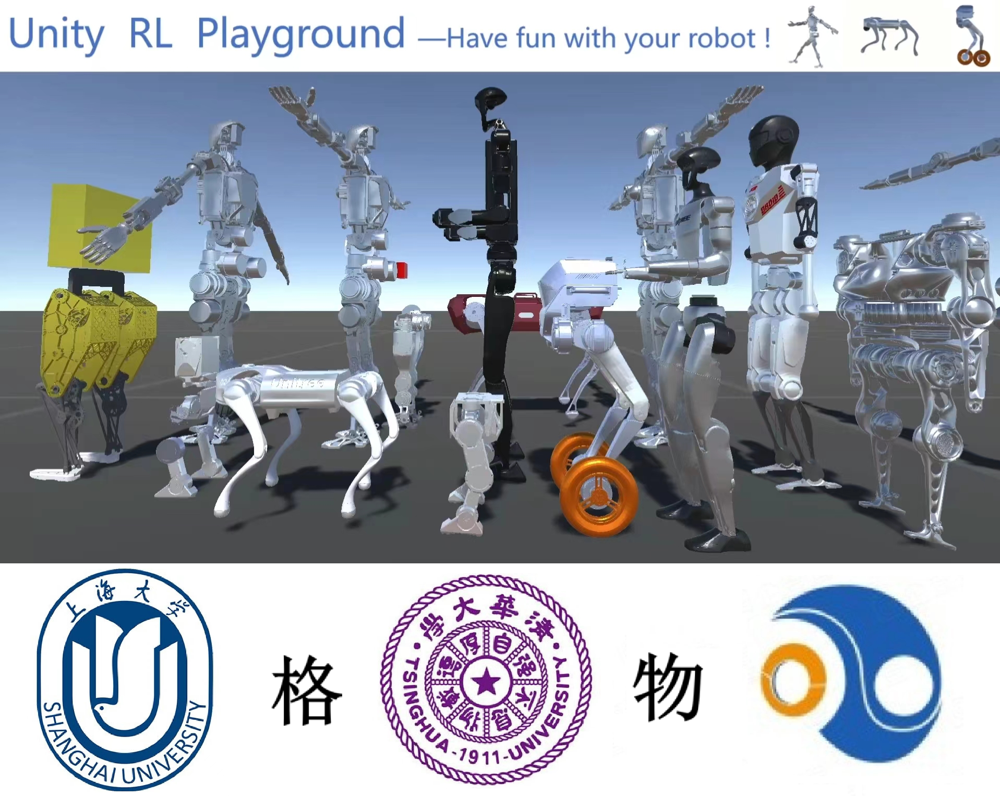
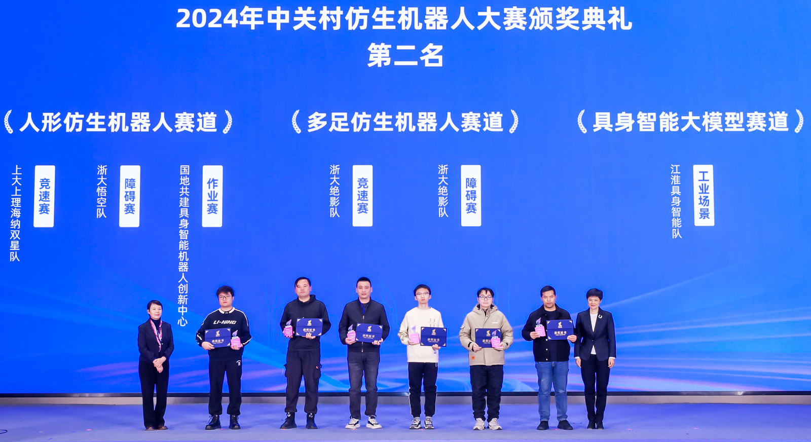

<link href='https://fonts.googleapis.com/css?family=Titillium+Web:400,600,400italic,600italic,300,300italic' rel='stylesheet' type='text/css'>

  
I am a second-year graduate student in Control Science and Engineering at the <a href="https://ai.shu.edu.cn/">School of Future Technology</a>, <a href="https://www.shu.edu.cn/">Shanghai University</a>. My supervisor is Professor <a href="https://linqi-ye.github.io/">Linqi Ye</a>. I completed my Bachelor's degree in Electronic and Information Engineering at the <a href="https://scie.shu.edu.cn/">School of Communication and Information Engineering</a>, Shanghai University. I am a beginner in reinforcement learning for legged/humanoid robots.

# Internships

    
    

      <strong style="font-size: 1em; color: #1772d0;">COWAROBOT Co., Ltd.</strong>
       Embodied Intelligent Robot Engineer
       2025.4--Now | <a href="https://www.cowarobot.com/" target="_blank">Web</a>
    

    
    

      <strong style="font-size: 1em; color: #1772d0;">Shanghai Droid Technology Co., Ltd.</strong>
       Bipedal Robot Motion Control Algorithm Engineer
       2024.12--2025.3 | <a href="https://droidup.com/" target="_blank">Web</a>
    

# Publications

## 2025

    
    

      <strong style="font-size: 1em; color: #1772d0;">Unity RL Playground: A Versatile Reinforcement Learning Framework for Mobile Robots</strong>
       Linqi Ye, <strong style="font-weight: 600; color: #f09228;">Rankun Li</strong>, Xiaowen Hu, Jiayi Li, Boyang Xing, Yan Peng, Bin Liang
       IROS, 2025, submited
       <a href="/files/iros25.pdf" target="_blank">PDF</a> | <a href="https://github.com/loongOpen/Unity-RL-Playground" target="_blank">Code</a>
    

## 2024

    
    

      <strong style="font-size: 1em; color: #1772d0;">Second Prize in Humanoid Robot Racing Competition</strong>
       Linqi Ye, Qingdu Li, <strong style="font-weight: 600; color: #f09228;">Rankun Li</strong>, Xiaowen Hu, Yuhang Xie
       ZHONGGUANCUN BIOMIMETIC ROBOT CONFERENCE, SHU-USST Hina Double Star Team, 2024 
       <a href="/images/prize.png" target="_blank">Prize</a> | <a href="/images/team.png" target="_blank">Team</a>
    

    
    

      <strong style="font-size: 1em; color: #1772d0;">Multi-Brain Collaborative Control for Quadruped Robots</strong>
       Hang Liu, Yi Cheng, <strong style="font-weight: 600; color: #f09228;">Rankun Li</strong>, Xiaowen Hu, Linqi Ye, Houde Liu
       CoRL, 2024, accepted
       <a href="/files/CoRL24.pdf" target="_blank">PDF</a> | <a href="https://quad-mbc.github.io/" target="_blank">Web</a>
    

## 2023

    
    

      <strong style="font-size: 1em; color: #1772d0;">High-precision Trajectory Tracking Control for Uncertain Nonminimum Phase Hypersonic Vehicles</strong>
       <strong style="font-weight: 600; color: #f09228;">Rankun Li</strong>, Ting Wu, Linqi Ye
       ONCON, 2023, accepted
       <a href="/files/ONCON.pdf" target="_blank">PDF</a> 
    

