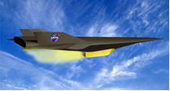

<!DOCTYPE html>
<html lang="en">
<head>
    <meta charset="UTF-8">
    <meta name="viewport" content="width=device-width, initial-scale=1.0">
    <title>About Me</title>
    <link href='https://fonts.googleapis.com/css?family=Titillium+Web:400,600,400italic,600italic,300,300italic' rel='stylesheet' type='text/css'>
    
</head>
<body>
    

        
I am a second-year graduate student in Control Science and Engineering at the <a href="https://ai.shu.edu.cn/">School of Future Technology</a>, <a href="https://www.shu.edu.cn/">Shanghai University</a>. My supervisor is Professor <a href="https://linqi-ye.github.io/">Linqi Ye</a>. I completed my Bachelor's degree in Electronic and Information Engineering at the <a href="https://scie.shu.edu.cn/">School of Communication and Information Engineering</a>, Shanghai University. I am a beginner in reinforcement learning for legged/humanoid robots.

        <h2 id="publications">Publications</h2>

        

            
            

                <strong style="font-size: 1em; color: #1772d0;">Multi-Brain Collaborative Control for Quadruped Robots</strong>
                 Hang Liu, Yi Cheng, <strong style="font-weight: 600; color: #f09228;">Rankun Li</strong>, Xiaowen Hu, Linqi Ye, Houde Liu
                 CoRL, 2024, submitted
                 <a href="/files/CoRL24.pdf" target="_blank">PDF</a> | <a href="https://quad-mbc.github.io/" target="_blank">web</a>
            

        

        

            
            

                <strong style="font-size: 1em; color: #1772d0;">High-precision Trajectory Tracking Control for Uncertain Nonminimum Phase Hypersonic Vehicles</strong>
                 <strong style="font-weight: 600; color: #f09228;">Rankun Li</strong>, Ting Wu, Linqi Ye
                 ONCON, 2023
                 <a href="/files/ONCON.pdf" target="_blank">PDF</a> 
            

        

    

</body>
</html>
