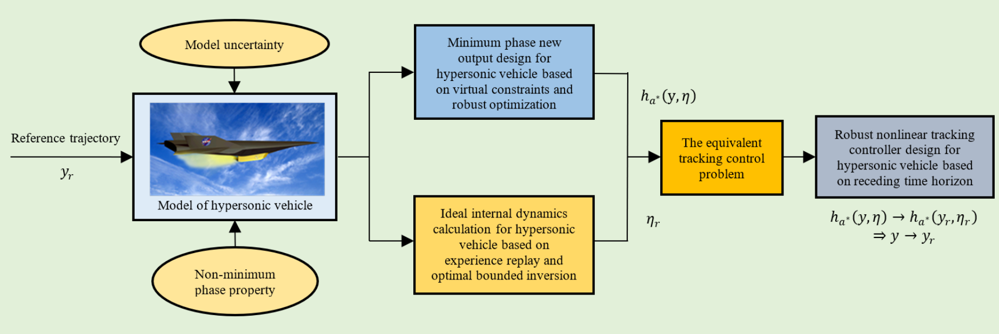

I am a second-year graduate student in Control Science and Engineering at the [School of Future Technology](https://ai.shu.edu.cn/), [Shanghai University](https://www.shu.edu.cn/). My supervisor is Professor [Linqi Ye](https://linqi-ye.github.io/). I completed my Bachelor's degree in Electronic and Information Engineering at the [School of Communication and Information Engineering](https://scie.shu.edu.cn/), Shanghai University. I am a beginner in reinforcement learning for legged/humanoid robots.
# Publications
## 2024

    
    

      <strong>Multi-Brain Collaborative Control for Quadruped Robots</strong>
       Hang Liu, Yi Cheng, <strong style="color: blue;">Rankun Li</strong>, Xiaowen Hu, Linqi Ye, Houde Liu
       CoRL, 2024, submitted
       <a href="/files/CoRL24.pdf" target="_blank">PDF</a> | <a href="https://quad-mbc.github.io/" target="_blank">web</a>
    

## 2023

    
    

      <strong style="white-space: nowrap; font-size: 1.2em;">High-precision Trajectory Tracking Control for Uncertain Nonminimum Phase Hypersonic Vehicles</strong>
       <strong style="color: blue; font-size: 1em;">Rankun Li</strong>, Ting Wu, Linqi Ye
       ONCON, 2023
       <a href="/files/ONCON.pdf" target="_blank">PDF</a> 
    

